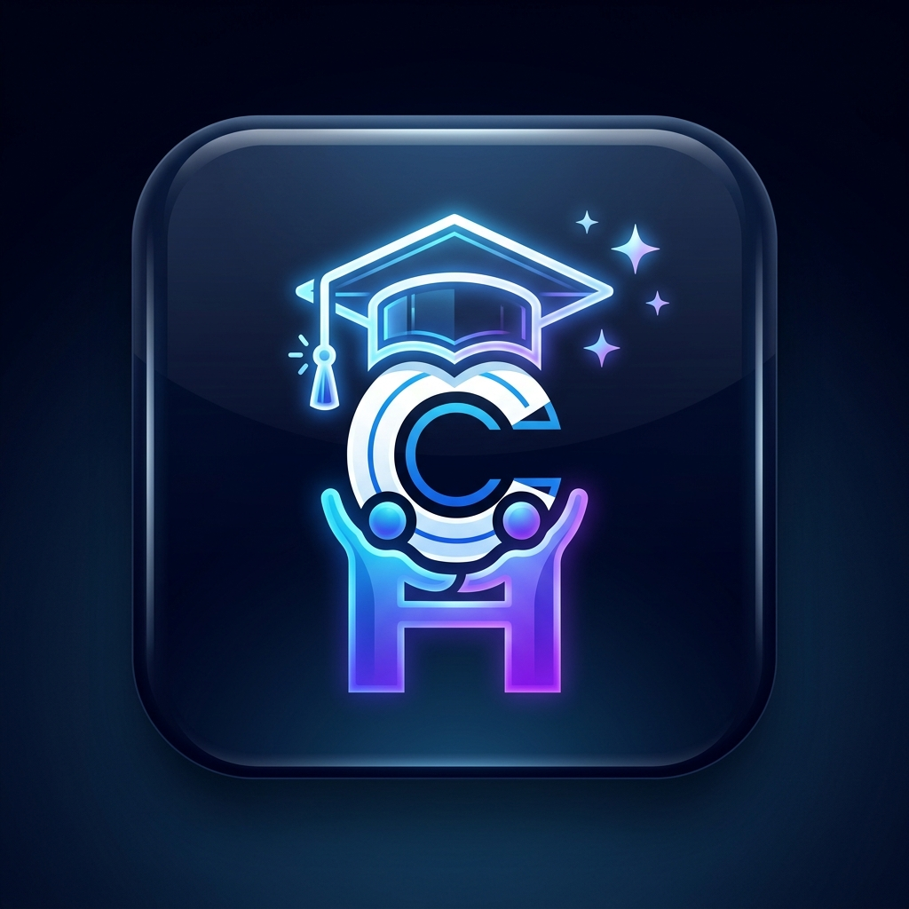

<div align="center">

  

  # 🎓 CampusHub AI
  ### **Autonomous Higher Education Operating System & Digitization Suite**
  *A unified, cloud-native platform connecting Students, Faculty, University Directorate, and Parents across Web and Mobile.*

  <p align="center">
    <a href="#-targeted-audience--who-is-this-for"></a>
    <a href="#-tech-stack-architecture"></a>
    <a href="#-tech-stack-architecture"></a>
    <a href="#-tech-stack-architecture"></a>
    <a href="#-enterprise-security--access-control"></a>
    <a href="#-automated-testing-quality-metrics"></a>
  </p>

  <p align="center">
    <b>"A Smarter Campus, Brighter You."</b> • <i>Modeled for KCC Institute of Technology & Management (KCCITM) Digitization</i>
  </p>

  <p align="center">
    <a href="#-quick-demo-access-accounts">🔑 Demo Accounts</a> •
    <a href="#-core-modules--workflows">⚡ Key Features</a> •
    <a href="#-targeted-audience--who-is-this-for">👥 Target Audience</a> •
    <a href="#-local-setup--quickstart">🚀 Run Locally</a> •
    <a href="#-cloud-deployment--apk-build">🌐 Vercel & APK Guide</a>
  </p>

</div>

---

## 🧭 What is CampusHub AI? (At a Glance)

Traditional higher education institutions suffer from **fragmented communication, paper-based passes, un-tracked student stress, and isolated department data**.

**CampusHub AI** replaces legacy siloed tools with **One Unified Digital Operating System**:
* 🌐 **Full-Stack Web Portal:** High-performance Next.js 16 Web Dashboard for deep administrative and academic workflows.
* 📱 **Native Mobile Application:** Cross-platform React Native (Expo SDK 54) App for instant campus access on iOS and Android.
* 🛡️ **Zero-Trust Role Hierarchy:** Strictly partitioned data access across 4 distinct stakeholders (Director, Faculty, Students, Parents).
* 🧠 **AI-Powered Campus Care:** 1:1 confidential emotional well-being check-ins, automated Bloom's rubric generation, and smart attendance telemetry.

---

## 👥 Targeted Audience & Who Is This For?

<div align="center">

| Persona | Core Focus & Responsibilities | Key Capabilities in CampusHub AI |
| :--- | :--- | :--- |
|  <br/> **College Director** | **Institutional Governance & Oversight** | Real-time teacher attendance by department, student section attendance matrix, appointment & approval of department admin leads. |
|  <br/> **Admin Staff** | **Departmental Operations & Records** | Placement officer (TPO) drives, Librarian catalogue, Finance fee dues ledgers, Registrar admission approvals. |
|  <br/> **Faculty / HODs** | **Classroom Delivery & Mentorship** | Scoped student directory, 1-tap class attendance, internal CIE marks grading, **Direct Parent Contact Desk** with calling windows. |
|  <br/> **Students** | **Learning, Career & Campus Life** | Live timetable, digital ID card, **1:1 AI Student Psychologist**, assignments desk, hostel gate outpass, canteen meal pre-orders. |
|  <br/> **Parents** | **Ward Tracking & Fee Management** | Real-time ward attendance (75% cutoff alerts), subject marksheets, 0% EMI fee planner, digital gate movement logs. |

</div>

---

## 🌐 Web & Mobile Seamless Parity

Both the **Web Application** and **Mobile App (`apps/mobile`)** share 100% feature and workflow parity:

```
┌──────────────────────────────────────────────────────────────────────────────────┐
│                                 CampusHub AI Core                                │
└──────────────────────────────────────────────────────────────────────────────────┘
                 ▲                                                 ▲
                 │                                                 │
  ┌───────────────────────────────┐               ┌────────────────────────────────┐
  │   🖥️ Next.js 16 Web Portal    │               │    📱 Expo Native Mobile App   │
  ├───────────────────────────────┤               ├────────────────────────────────┤
  │ • Turbopack SSR/SSG Engine    │               │ • React Native (Expo SDK 54)   │
  │ • Tailwind CSS v4 System      │               │ • iOS & Android Single Codebase│
  │ • Interactive Data Tables     │               │ • Offline-First Native Views   │
  │ • Role-Specific Sidebars      │               │ • Smooth Bottom Tab Navigator  │
  │ • High-Contrast Accessibility │               │ • QR Gatepass Scanner          │
  └───────────────────────────────┘               └────────────────────────────────┘
```

---

## ⚡ Core Modules & Innovative Workflows

### 1. 🧠 1:1 Confidential AI Student Psychologist & Mind Companion
* **✨ Coming Soon Highlight**: Designed as an empathetic, confidential AI talking companion for students.
* **Proactive Well-Being**: Bi-weekly (twice a month) 5–10 minute voice/text check-in to detect exam depression, low marks anxiety, or hesitation in college.
* **Faculty Advisor Bridge**: Generates non-stigmatizing, confidential briefings for the assigned mentor so faculty can provide support without putting students under pressure.

### 2. 👑 Director Attendance & Governance Telemetry Desk
* **Department-Wise Teacher Presence**: Real-time breakdown across CSE (94.1%), ECE (92.8%), ME (91.6%), CE (90.0%), and Management (93.5%).
* **Granular Student Attendance Matrix**: Filterable sheets by Year (1–4), Semester (1–8), and Section (A–D) with single-click export.
* **Department Staff Authorization**: Director approves or suspends departmental administrative leads.

### 3. 👩‍🏫 Faculty Scoped Student & Direct Parent Reachout Desk
* **Zero Cross-Exposure**: Faculty members only view students enrolled in their assigned subjects.
* **Parent Reachout Card**: Verified guardian phone number (`+91 98765 11223`) and preferred calling window (*"After 04:00 PM"*).
* **Automated Defaulter Alerts**: Automatic highlighting for students falling below the mandatory 75% attendance threshold.

### 4. 🎫 Smart Digital Gatepass & Turnstile Security
* **Frictionless Outpass**: Digital hostel pass with live QR validation.
* **Parent Synchronized Alerts**: Parents receive instant notification when an outpass is approved and when the student returns to campus.

### 5. 💼 AI ATS Resume Optimizer & Placement Drives Hub
* **Real-Time Job Feeds**: Top recruitment drives (Amazon, TCS, Infosys) with CTC statistics.
* **AI ATS Scoring**: Keyword match analysis against job descriptions with role-tailored optimization suggestions.

---

## 🔑 Quick Demo Access Accounts

<div align="center">

| Role | Name & Title | Email Address | Password | Focus Area |
| :--- | :--- | :--- | :--- | :--- |
| **Director** | Anuraj Singh (Chief Executive Admin) | `ajsinghindolia@gmail.com` | `001234` | College governance & attendance telemetry |
| **Admin** | Suresh Sharma (TPO Lead) | `suresh.tpo@kcc.campushub.edu.in` | `Admin@123` | Placement drives & CTC statistics |
| **Admin** | Rakesh Kumar (Registrar) | `rakesh.acad@kcc.campushub.edu.in` | `Admin@123` | Admission approvals & student verifications |
| **Faculty** | Dr. Priya Sharma (HOD CSE) | `faculty@campushub.ai` | `Faculty@123` | Class attendance, CIE grading & parent reachout |
| **Student** | Arjun Singh (B.Tech CSE Year 3) | `student@campushub.ai` | `Student@123` | Timetable, ID pass, AI psychologist, library |
| **Parent** | Sunita Singh (Guardian) | `parent@campushub.ai` | `Parent@123` | Ward marksheet, fee ledger, gatepass alerts |

</div>

---

## 🛠️ Tech Stack & Architecture

```
┌─────────────────┬─────────────────────────────────────────────────────────────────┐
│ Layer           │ Technology Stack                                                │
├─────────────────┼─────────────────────────────────────────────────────────────────┤
│ Web Frontend    │ Next.js 16.3 (Turbopack), React 19, Tailwind CSS v4, Lucide     │
│ Mobile App      │ React Native 0.81, Expo SDK 54, React Native SVG, Reanimated    │
│ Backend API     │ Next.js Route Handlers (RESTful, Zero-Trust Role Middleware)    │
│ Database & ORM  │ Prisma ORM 5.22, SQLite (Local/Dev) / PostgreSQL (Production)   │
│ Security & Auth │ Bcrypt Password Hashing, Session Cookies, Immutable Audit Logs │
│ Type Safety     │ TypeScript 5.9 (Strict mode across Web & Mobile)                │
└─────────────────┴─────────────────────────────────────────────────────────────────┘
```

<details>
<summary><b>🧪 62/62 Automated API Endpoint Tests (Click to Expand)</b></summary>

```
====================================================
  CAMPUSHUB AI - AUTOMATED ENDPOINT HEALTH TEST SUITE (v3.3.0)
====================================================

  ✔ PASS [200] /api/clubs (75ms)
  ✔ PASS [200] /api/transport (1ms)
  ✔ PASS [200] /api/gatepass (0ms)
  ✔ PASS [200] /api/system-health (1ms)
  ✔ PASS [200] /api/system-health (DR Simulation) (2ms)
  ✔ PASS [200] /api/course-feedback (0ms)
  ✔ PASS [200] /api/budget (0ms)
  ✔ PASS [200] /api/cafeteria (2ms)
  ✔ PASS [200] /api/alumni (3ms)
  ✔ PASS [200] /api/wellness (1ms)
  ✔ PASS [200] /api/hostel (7ms)
  ✔ PASS [200] /api/ai/code-check (1ms)
  ✔ PASS [200] /api/labs/simulations (1ms)
  ✔ PASS [200] /api/study-groups (0ms)
  ✔ PASS [200] /api/hostel/laundry (0ms)
  ✔ PASS [200] /api/transport/bikes (0ms)
  ✔ PASS [200] /api/student-budget (0ms)
  ✔ PASS [200] /api/alumni/referrals (0ms)
  ✔ PASS [200] /api/events/live-poll (0ms)
  ✔ PASS [200] /api/lost-found/claims (0ms)
  ✔ PASS [200] /api/ai/exam-generator (1ms)
  ✔ PASS [200] /api/assignments/rubrics (0ms)
  ✔ PASS [200] /api/faculty/office-hours (0ms)
  ✔ PASS [200] /api/faculty/accreditation (0ms)
  ✔ PASS [200] /api/labs/maintenance (0ms)
  ✔ PASS [200] /api/admin/sustainability (0ms)
  ✔ PASS [200] /api/security/visitors (0ms)
  ✔ PASS [200] /api/admin/timetable (0ms)
  ✔ PASS [200] /api/admin/iot (0ms)
  ✔ PASS [200] /api/admin/endowment (0ms)
  ✔ PASS [200] /api/admin/audit-logs (0ms)
  ✔ PASS [200] /api/parent/ptm (0ms)
  ✔ PASS [200] /api/parent/safety (0ms)
  ✔ PASS [200] /api/parent/mess (0ms)
  ✔ PASS [200] /api/certificates/generate-pdf (1ms)
  ✔ PASS [200] /api/ai/research-summarizer (GET) (0ms)
  ✔ PASS [201] /api/ai/research-summarizer (POST) (1ms)
  ✔ PASS [200] /api/ai/mock-interview (GET) (0ms)
  ✔ PASS [200] /api/ai/mock-interview (POST) (1ms)
  ✔ PASS [200] /api/transport/carpool (GET) (0ms)
  ✔ PASS [200] /api/tutoring (GET) (0ms)
  ✔ PASS [200] /api/printing (GET) (0ms)
  ✔ PASS [200] /api/hostel/chores (GET) (0ms)
  ✔ PASS [200] /api/sports (GET) (0ms)
  ✔ PASS [200] /api/faculty/grants (GET) (0ms)
  ✔ PASS [200] /api/faculty/ta (GET) (0ms)
  ✔ PASS [200] /api/faculty/cie (GET) (0ms)
  ✔ PASS [200] /api/faculty/guest-lectures (GET) (0ms)
  ✔ PASS [200] /api/faculty/early-warning (GET) (0ms)
  ✔ PASS [200] /api/faculty/appraisal (GET) (0ms)
  ✔ PASS [200] /api/faculty/ipr (GET) (0ms)
  ✔ PASS [200] /api/admin/ev-charging (GET) (0ms)
  ✔ PASS [200] /api/admin/procurement (GET) (0ms)
  ✔ PASS [200] /api/admin/water (GET) (0ms)
  ✔ PASS [200] /api/admin/emergency-broadcast (GET) (0ms)
  ✔ PASS [200] /api/admin/rfid (GET) (0ms)
  ✔ PASS [200] /api/admin/rankings (GET) (0ms)
  ✔ PASS [200] /api/parent/health (GET) (0ms)
  ✔ PASS [200] /api/parent/fee-installments (GET) (0ms)
  ✔ PASS [200] /api/parent/livestreams (GET) (0ms)
  ✔ PASS [200] /api/auth/change-password (POST) (202ms)
  ✔ PASS [200] /api/auth/change-password (Reset to 001234) (182ms)

====================================================
  SUITE RUN COMPLETE: 62/62 Passed (0 Failed)
  Pass Rate: 100.0%
====================================================
```
</details>

---

## 🚀 Local Setup & Quickstart

### 1. Clone & Install
```bash
git clone https://github.com/its-anuraj/CampusHub-AI.git
cd CampusHub-AI

# Install Web Dependencies
npm install

# Install Mobile App Dependencies
cd apps/mobile
npm install
cd ../..
```

### 2. Environment Setup & Database Seed
```bash
# Push database schema & seed demo users
npx prisma db push
npx prisma db seed
```

### 3. Run Web & Mobile Apps
* **Start Web Server:**
  ```bash
  npm run dev
  ```
  Open: `http://localhost:3000`

* **Start Mobile App (with Tunnel for all phones):**
  ```bash
  npm run expo -- --tunnel -c
  ```

---

## 🌐 Cloud Deployment & APK Build

### A. Deploy Web App to Vercel (1-Click Setup)
1. Push your repository to GitHub.
2. Go to [Vercel](https://vercel.com) and click **"Import Project"** for `CampusHub-AI`.
3. Add Environment Variables:
   * `DATABASE_URL`: Your Supabase / Neon PostgreSQL connection string.
   * `NEXTAUTH_SECRET`: Random 32-character secret.
   * `NEXTAUTH_URL`: Your production Vercel domain.
4. Set Build Command: `prisma generate && prisma db push && next build`.
5. Click **"Deploy"**!

### B. Build Standalone Android APK (Expo EAS)
1. Install EAS CLI: `npm install -g eas-cli`
2. Log in: `eas login`
3. Trigger Cloud APK Build:
   ```bash
   cd apps/mobile
   eas build -p android --profile preview
   ```
4. Download the `.apk` file directly from the link provided upon completion (~5 mins).

---

## 🗺️ Future Institutional Roadmap

- [ ] **College ERP Integration**: Direct synchronization with on-campus legacy databases.
- [ ] **Biometric Turnstile Hardware Bridge**: Direct MQTT/REST IoT connector for physical turnstiles.
- [ ] **WhatsApp Enterprise Gateway**: Automated attendance updates and emergency parent alerts.

---

<div align="center">
  <b>CampusHub AI © 2026. All rights reserved.</b><br/>
  <i>Crafted with ❤️ for Higher Education Digitization & Student Care.</i>
</div>
