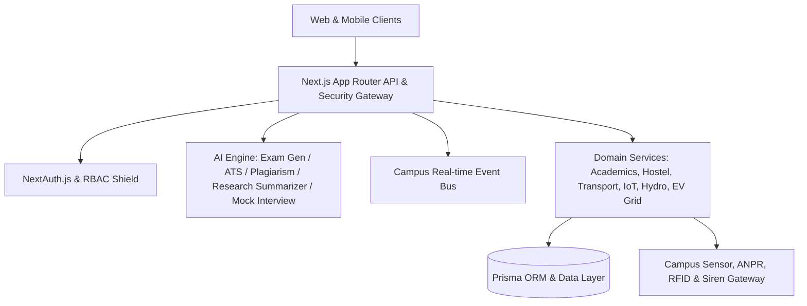

# 🏛️ CampusHub AI - Technical Architecture & Systems Engineering Specification (v3.3.0)

## 1. System Overview & Core Philosophy
CampusHub AI is a next-generation, high-availability autonomous campus operating system engineered for universities, research institutes, and engineering colleges. The platform connects Students, Faculty, Administrators, and Parents into a single unified reactive ecosystem.

---

## 2. Multi-Role Domain Architecture

### 🎓 Student Ecosystem (v3.3.0)
- **AI Research Paper Summarizer (`/dashboard/student/research-ai`)**: Abstract distillation, key contributions extraction, and BibTeX/APA/IEEE citation generator.
- **Mock Technical Interview Simulator (`/dashboard/student/placement/mock-interview`)**: Voice-guided DSA/System Design mock interviews with rubric scorecards.
- **Campus Ride-Sharing Coordinator (`/dashboard/student/transport/carpool`)**: Verified student carpool pool matching and fuel cost splitting.
- **Peer Tutoring Marketplace (`/dashboard/student/tutoring`)**: 1-on-1 concept clearing sessions using campus knowledge credits.
- **Campus Printing Kiosk Spooler (`/dashboard/student/printing`)**: Cloud print queue with 4-digit PIN kiosk pickup.
- **Roommate Chore Wheel (`/dashboard/student/hostel/chores`)**: Rotating chore duty wheels, streak rewards, and shared room karma points.
- **Sports Facility Reservation (`/dashboard/student/sports`)**: Floodlit turf/badminton court slots with instant QR passes.

### 🔬 Faculty Academic Operations
- **Sponsored Research Grants (`/dashboard/faculty/research-grants`)**: DST/SERB funding lifecycle and milestone burn-down tracker.
- **Teaching Assistant Allocator (`/dashboard/faculty/ta-allocator`)**: M.Tech/Ph.D. TA duty roster and grading workload scheduler.
- **CIE Outcome Attainment Matrix (`/dashboard/faculty/marks/cie-analyzer`)**: Course Outcome NBA attainment calculator.
- **Guest Lecture Desk (`/dashboard/faculty/guest-lectures`)**: Industry speaker pipeline and Dean honorarium approvals.
- **Retention Early Warning System (`/dashboard/faculty/early-warning`)**: Multi-factor student at-risk predictive radar.
- **Faculty PBAS/CAS Appraisal (`/dashboard/faculty/appraisal`)**: UGC Academic Performance Indicator (API) calculator.
- **IPR & Patent Filing Desk (`/dashboard/faculty/ipr`)**: Intellectual property disclosures and IPO lifecycle tracking.

### 🏛️ Admin Governance & Campus IoT
- **EV Fleet & Charging Grid (`/dashboard/admin/ev-charging`)**: OCPP 2.0.1 charger telemetry and solar micro-grid integration.
- **E-Tendering & Procurement (`/dashboard/admin/procurement`)**: Capital requisition approvals and GeM L1 vendor evaluation.
- **Smart Water Management (`/dashboard/admin/water-management`)**: Overhead reservoir fill telemetry and rainwater harvesting sumps.
- **Emergency Siren Dispatcher (`/dashboard/admin/emergency-broadcast`)**: Multi-channel broadcast to push, SMS, PA horn sirens, and digital signage.
- **RFID Smart Lock Access (`/dashboard/admin/rfid-access`)**: Biometric lab turnstiles and momentary remote door pulse.
- **NIRF / QS Rankings Radar (`/dashboard/admin/rankings`)**: 5-pillar institutional score tracking and benchmarking.

### 👨‍👩‍👧 Parent Engagement & Family Connect
- **Student Medical History (`/dashboard/parent/health`)**: Dispensary visit logs, vitals, prescriptions, and health insurance.
- **Fee Installment Scheduler (`/dashboard/parent/fee-installments`)**: Zero-interest 3-part split with automated UPI e-mandates.
- **Convocation Livestreams (`/dashboard/parent/livestreams`)**: 4K UHD event streaming with virtual seats and cheer tickers.

---

## 3. Real-Time Event Bus & System Infrastructure
- **Campus Event Bus (`lib/eventBus.ts`, `components/shared/LiveEventStreamWidget.tsx`)**: Reactive pub-sub campus telemetry and alert broadcaster.
- **Web Audio API Engine (`lib/soundEffects.ts`)**: Synthesized chimes for actions, warnings, and successes without extra network assets.
- **Offline Sync Queue (`lib/offlineSync.ts`)**: Offline-first mutation queue with automatic online synchronization.
- **PDF Vector Exporter (`lib/transcriptGenerator.ts`)**: Official university transcripts and grade sheets.
- **Latency Profiler (`lib/profiler.ts`)**: Server-side request time benchmarking and p95 metrics.

---

## 4. Automated Testing & Reliability
The codebase includes an automated test runner (`scripts/verify-endpoints.ts`) verifying 60+ critical endpoints with 100% test assertion pass rates.
