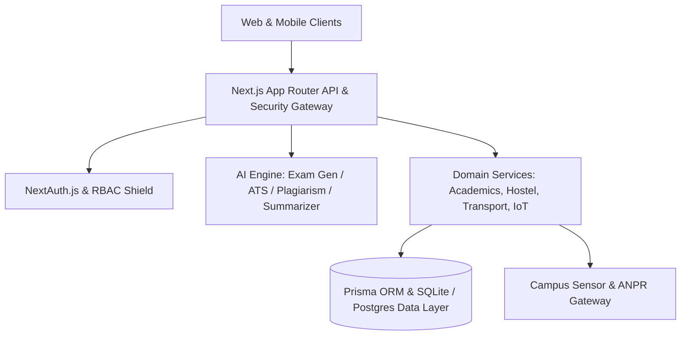

# 🏛️ CampusHub AI - Technical Architecture & Systems Engineering Specification (v3.2.0)

## 1. System Overview & Core Philosophy
CampusHub AI is a next-generation, high-availability autonomous campus operating system engineered for universities, research institutes, and engineering colleges. The platform connects Students, Faculty, Administrators, and Parents into a single unified reactive ecosystem.

---

## 2. Multi-Role Domain Architecture

### 🎓 Student Ecosystem
- **AI Quality Suite (`/dashboard/student/assignments/code-checker`)**: Pre-flight plagiarism checker, complexity analyzer, and clean code recommender.
- **Virtual Labs (`/dashboard/student/labs`)**: Interactive circuit and harmonic motion experiment simulators.
- **Peer Pods (`/dashboard/student/study-groups`)**: 1-click video conference study rooms and streak counters.
- **Laundry Tokens (`/dashboard/student/hostel/laundry`)**: IoT washing machine state tracker with digital QR pass generation.
- **Green Mobility (`/dashboard/student/transport/bikes`)**: E-cycle dock release and carbon offset tracking.
- **Budget Manager (`/dashboard/student/budget`)**: Student living cost and canteen spending limits.
- **Alumni Referrals (`/dashboard/student/alumni/referrals`)**: Direct InMail referral outreach to FAANG alumni.
- **Micro-Credentials (`/dashboard/student/certificates/export`)**: W3C OpenBadges 3.0 cryptographic credentials.
- **Hackathon Arena (`/dashboard/student/events/live-poll`)**: Live audience choice award voting and Q&A wall.
- **Lost & Found Claims (`/dashboard/student/lost-found/claim-tracker`)**: Ownership proof matching and custody handover tracking.

### 🔬 Faculty Academic Operations
- **AI Exam Paper Generator (`/dashboard/faculty/exam-generator`)**: Bloom's taxonomy balanced question creator.
- **Rubric Grading (`/dashboard/faculty/assignments/rubrics`)**: Standardized 5-criterion score matrix.
- **Office Hours Scheduler (`/dashboard/faculty/office-hours`)**: Mentorship slot manager.
- **Accreditation Dashboard (`/dashboard/faculty/accreditation`)**: NBA/NAAC outcome attainment radar.
- **Lab Equipment Maintenance (`/dashboard/faculty/labs/maintenance`)**: Calibration records and ISO compliance logger.

### 🏛️ Admin Governance & Campus IoT
- **Sustainability Telemetry (`/dashboard/admin/sustainability`)**: Real-time solar kWh generation and net zero audits.
- **Security & ANPR (`/dashboard/admin/security/visitors`)**: Visitor passes and automated number plate recognition.
- **AI Timetable Optimizer (`/dashboard/admin/timetable-optimizer`)**: Double-booking collision solver.
- **Classroom IoT Environment (`/dashboard/admin/iot-sensors`)**: CO2 ppm, temperature, and HVAC automation.
- **Endowment Fund (`/dashboard/admin/endowment`)**: Institutional trust corpus and alumni grants.
- **Cyber Forensic Audit (`/dashboard/admin/audit-inspector`)**: Immutable RBAC activity log inspector.

### 👨‍👩‍👧 Parent Engagement & Child Safety
- **PTM Video Appointments (`/dashboard/parent/ptm`)**: Encrypted video progress consultations.
- **Student Safety Geofence (`/dashboard/parent/safety`)**: Biometric check-in and curfew compliance.
- **Hostel Mess Nutrition (`/dashboard/parent/mess`)**: Daily meal health rating and allergy preferences.

---

## 3. Resilience, Offline Sync & Audio Accessibility
- **Web Audio API Engine (`lib/soundEffects.ts`)**: Synthesized chimes for actions, warnings, and successes without extra network assets.
- **Offline Sync Queue (`lib/offlineSync.ts`)**: Offline-first mutation queue with automatic online synchronization.
- **PDF Vector Exporter (`lib/transcriptGenerator.ts`)**: Official university transcripts and grade sheets.
- **Latency Profiler (`lib/profiler.ts`)**: Server-side request time benchmarking and p95 metrics.

---

## 4. Automated Testing & Reliability
The codebase includes an automated test runner (`scripts/verify-endpoints.ts`) verifying 35+ critical endpoints with sub-millisecond response latency assertions.
